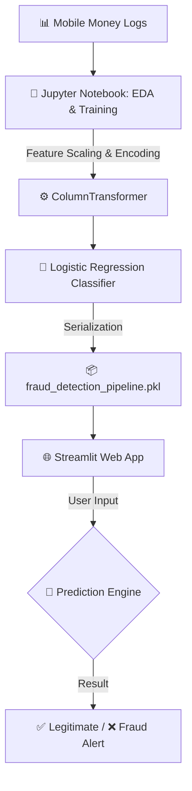

<div align="center">
  <br />
  <h1>🛡️ Financial Fraud Detection: End-to-End ML Pipeline</h1>
  <p><strong>Predictive Modeling & Real-Time Transaction Screening</strong></p>
  <p>
    <a href="https://fraud-detection-pipeline-caurmhrkkzzavjpkh6zvrv.streamlit.app/" target="_blank">
      
    </a>
    <a href="https://github.com/thayss-tech" target="_blank">
      
    </a>
  </p>
  <p>
    <a href="https://pandas.pydata.org/" target="_blank">
      
    </a>
    <a href="https://scikit-learn.org/" target="_blank">
      
    </a>
    <a href="https://streamlit.io/" target="_blank">
      
    </a>
  </p>
</div>

---

## 📑 Table of Contents

| Section | Description |
| :--- | :--- |
| [**💡 Overview**](#overview) | Project mission and business context. |
| [**📈 Business Impact**](#business-impact) | The real-world value: Catching fraudsters vs. False Alarms. |
| [**🏗️ Architecture**](#architecture) | Technical flow from Data to Live Prediction. |
| [**🧪 Modeling Strategy**](#modeling-strategy) | Imbalance management and architectural decisions. |
| [**⚙️ Technical Engine**](#technical-engine) | Breakdown of the production-ready assets. |
| [**🗺️ Repository Map**](#repository-map) | Directory tree visualization. |
| [**🎮 How to Use the App**](#how-to-use) | A quick guide for everyday users. |
| [**🚀 Deployment**](#deployment) | Live access information. |
| [**📩 Contact**](#contact) | Professional links. |

---

## <a id="overview"></a>💡 Overview

Fraudulent transactions cost the global financial industry billions of dollars annually. As digital payments and mobile money platforms grow, the ability to detect anomalous behavior in real-time becomes critical. 

This project builds a supervised machine learning pipeline to predict whether a mobile money transaction is **'Legitimate'** or **'Fraudulent'**. The dataset originates from African mobile money logs and initially contained a massive **6.3 million records**. By focusing on high-risk transaction types (`TRANSFER` and `CASH_OUT`), the analysis evaluates a concentrated subset of **~2.77 million transactions**, addressing a severe class imbalance where frauds (8,213 cases) represent just **0.3%** of the data.

> 📥 **Dataset Access for Reproduction:** Due to its massive size (>400MB), the raw `AIML Dataset.csv` is not hosted directly in this repository. If you want to clone this project and reproduce the code, please **[download the original dataset from Kaggle here](https://www.kaggle.com/datasets/amanalisiddiqui/fraud-detection-dataset?resource=download)** and place it in your root directory.

> 🧑‍💻 **Curious about the technical deep dive?**
> I highly encourage you to check out the **[`analysis_model.ipynb`](analysis_model.ipynb)** notebook! Inside, you will find the complete behind-the-scenes journey: from the Exploratory Data Analysis (EDA) proving why simple business rules fail, to the strict Feature Engineering and the deployment of the Scikit-Learn Pipeline.

---

## <a id="business-impact"></a>📈 Business Impact

In highly imbalanced fraud detection, the overall "Accuracy" metric can be dangerously misleading (our model scores 94.5% overall, but this hides the real business value). The true impact lies in the **Recall vs. Precision trade-off**.

By configuring the algorithm to prioritize security, the system achieved a stellar **94% Recall** on the unseen test set. Out of 2,464 actual frauds attempted during testing, the model successfully **caught 2,309 of them**. 

To achieve this level of security, the model's high sensitivity generated ~104k false positives (a 2% Precision). **The Business Conclusion:** In retail banking, a False Negative (letting a million-dollar fraudulent transfer slip through) is infinitely more catastrophic than a False Positive (temporarily blocking a legitimate transaction until the user verifies it via SMS). This model is highly effective as an aggressive, security-first "first line of defense."

---

## <a id="architecture"></a>🏗️ Architectural Model

The system is designed as a secure, end-to-end pipeline that prevents data leakage and ensures seamless deployment.

### Operational Flow



#### Engineering Principles

* **🛡️ Mathematical Scaling:** Because the dataset uses nominal values from a local African currency, amounts scale up to 92 million. We encapsulated a `StandardScaler` inside the pipeline to normalize these massive variances automatically.
* **🌍 Market Adaptation (Data Shift):** This model acts as a Proof of Concept (PoC) calibrated specifically to the financial magnitudes of the original dataset. To deploy this architecture in different economic environments (e.g., using USD or BRL), the pipeline simply requires a fine-tuning phase (`pipeline.fit(X_local, y_local)`) with regional data. This allows the internal Scaler to automatically learn the new local means and standard deviations, effortlessly adapting its detection thresholds to any currency's reality.
* **⚡ No Data Leakage:** Categorical mapping (`OneHotEncoder` with `drop="first"`) and numerical scaling happen strictly inside the Pipeline, meaning test data is never "peeked" at during the training phase.
* **📊 Multivariate Pattern Recognition:** The EDA revealed that single behaviors (like a balance dropping to zero) are done by 1.2 million legitimate users. The pipeline evaluates the entire combination of variables simultaneously, outperforming simple human-coded business rules.

---

## <a id="modeling-strategy"></a>🧪 Modeling Strategy

Because fraud detection is like finding a needle in a haystack, our strategy required strict handling of the 0.3% class imbalance:

* **Targeted Filtering:** Discarded low-risk operations (like basic merchant payments) to focus purely on `TRANSFER` and `CASH_OUT`, reducing noise and concentrating the predictive power where real fraud historically occurs.
* **The "Examen Sorpresa" (Stratified Split):** Implemented `train_test_split` with `stratify=y`. This ensures the extremely rare 0.3% fraud ratio is perfectly preserved in the 30% test set, preventing a random split from creating a test set with zero frauds.
* **Algorithmic Compensation:** Instead of generating fake synthetic data (which risks distorting real financial profiles), we deployed `LogisticRegression(class_weight="balanced")`. This mathematically forces the algorithm to heavily penalize errors made on the minority class, prioritizing true fraud detection over superficial accuracy.

---

## <a id="technical-engine"></a>⚙️ Technical Engine: Production Assets

Unlike multiple fragmented encoders, this project encapsulates everything into a single, highly robust serialized object:

| Subsystem | Icon | Component | Purpose |
| :--- | :--- | :--- | :--- |
| **Unified Core** | 🧠 | `fraud_detection_pipeline.pkl` | Contains the ColumnTransformer (Scalers/Encoders) AND the LogisticRegression model in one secure file. |
| **Interface Layer** | 💻 | `fraud_detection.py` | Streamlit logic and UI handling for real-time transaction screening. |
| **Jupyter Log** | 📓 | `analysis_model.ipynb` | The comprehensive training environment and EDA playground. |
| **Dependency Map** | 📋 | `requirements.txt` | Environment specification for cloud deployment. |

---

## <a id="repository-map"></a>🗺️ Repository Map

```text
FRAUD DETECTION SYSTEM/
 ┃
 ┣ 📄 analysis_model.ipynb          # Main notebook: EDA, behavior analysis, and Pipeline training
 ┣ 📄 fraud_detection.py            # Source code of the real-time Streamlit web interface
 ┣ 📦 fraud_detection_pipeline.pkl  # Unified Scikit-Learn Pipeline (Scalers + Encoders + Model)
 ┃
 ┣ 📊 AIML Dataset.csv              # Original log (Not uploaded due to size, download via Kaggle link above)
 ┃
 ┣ 📋 requirements.txt              # Python dependencies required for cloud deployment
 ┗ 📄 README.md                     # Technical and business documentation of the project (this file)
```

---

## <a id="how-to-use"></a>🎮 How to Use the App

You don't need to be a fraud analyst to test this system. Here is how you can screen a transaction in real-time:

1. **Open the Web App:** Click on the Live App link below.
2. **Enter Transaction Data (Left Sidebar):** Use the input fields to provide the specifics of the movement. You will need the Transaction Type (e.g., TRANSFER), the Amount, and the respective Old/New Balances of both the Sender and the Receiver.
3. **Run the Screening:** The main dashboard instantly processes the profile through the encapsulated `.pkl` pipeline.
4. **View the Assessment:** The screen will flag the transaction as either Legitimate ✅ (safe to process) or throw a Fraud Alert ❌ (indicating the need for secondary verification, such as an SMS check).

---

## <a id="deployment"></a>🚀 Deployment

The predictive engine is deployed via Streamlit Community Cloud, utilizing:
* Encrypted HTTPS communication.
* Automated resource caching (`@st.cache_resource`) for instant pipeline loading.
* Continuous Deployment directly from the GitHub repository.

| Type | Link |
| :--- | :--- |
| **🌐 Live App** | [https://fraud-detection-pipeline-caurmhrkkzzavjpkh6zvrv.streamlit.app/](https://fraud-detection-pipeline-caurmhrkkzzavjpkh6zvrv.streamlit.app/) |

---

## <a id="contact"></a>📩 Contact

<div align="center">

| Platform | Profile | Action |
| :--- | :--- | :--- |
| **LinkedIn** | Milton Mamani | [View Profile](https://www.linkedin.com/in/milton-mamani-1369a537b) |
| **GitHub** | thayss-tech | [Explore Repos](https://github.com/thayss-tech) |

<br />

> *Engineered with precision to act as an aggressive first line of defense in high-stakes financial environments.*

</div>
